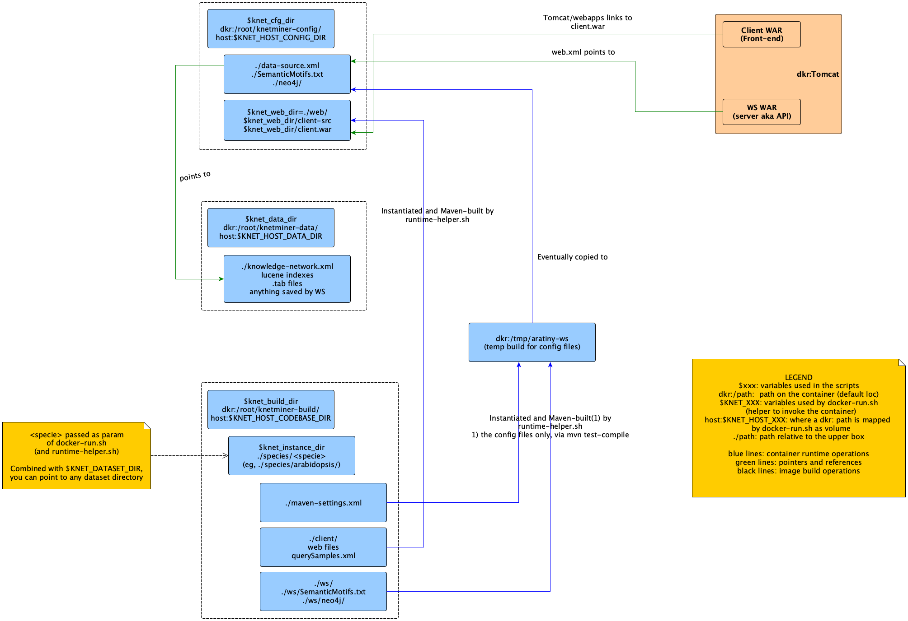

# Deploying Knetminer with Docker


## Index

- [Index](#index)
- [Introduction](#introduction)
- [Running Knetminer via Docker](#running-knetminer-via-docker)
- [Configuring a Knetminer container](#configuring-a-knetminer-container)
- [Using Dockerised Knetminer with Amazon AWS and ElasticBeanStalk](#using-dockerised-knetminer-with-amazon-aws-and-elasticbeanstalk)
- [The Knetminer Docker architecture](#the-knetminer-docker-architecture)
- [Troubleshooting](#troubleshooting)


## Introduction

Knetminer can be deployed in a quick and simple way, using the Docker container platform. In 
the simplest case, you just need to install the Docker environment and get our
[Knetminer image from DockerHub][10]. For more advanced uses, our image can be used with 
host-provided configurations. Additionally, you can customise our [image definitions]
(#the-knetminer-docker-architecture).  

[10]: https://cloud.docker.com/u/knetminer/repository/docker/knetminer/knetminer


## Running Knetminer via Docker

### Quick start with the sample dataset

You can quickly run an instance of Knetminer, based on a small sample data set (a subset of the 
[Arabidopsis Thaliana](https://knetminer.rothamsted.ac.uk/Arabidopsis_thaliana/). To do so, just 
install Docker and issue this line commad:

`docker run -p 8080:8080 -it knetminer/knetminer`

This will get our Knetminer image straight from Docker Hub. You'll see output on your 
shell Window and eventually you'll be able to access the sample application via 
http://localhost:8080/client (as usually, you can change the port on the host via `-p`).  

Running without further parameters makes our container to use the configuration and data it 
has in its file system (which, as said, is the Arabidopsis subset). By using volume-related parameters, 
you can reuse the same image (without rebuilds) to instantiated Knetminer against configuration and data 
files located on your host (more in [this section](#configuring-a-knetminer-container)).  

*Note: the `-it` options are needed because of the way the startup command associated to our container works,
as explained [here](https://stackoverflow.com/a/41099052/529286).*

### <a name = "buildingKNM">Building and running the Knetminer image</a>

Optionally, you can build our image from our source files and run it as above. To do so, 
git-clone our [code base](https://github.com/Rothamsted/knetminer) and issue this command 
**from the root of the cloned repository**:

`docker build -t knetminer/knetminer -f common/quickstart/Dockerfile .`

Note that the `-t` is optional and, if you use it, it would be advisable to use your own tag 
for the newly built image (eg, `a_dockhub_user/knetminer`).  


### Instantiating a specific dataset 

The built image can be run against one of the existing pre-packaged configurations, each 
representing a different knowledge base (ie, dataset), where each knwolege base/datase usually 
contains information focused on a given specie. This makes it possible to re-use 
one image to run multiple Knetminer applications, each dedicated to a particular dataset or specie.

Predefined configurations are stored in our codebase, under the [specie/][90] directory.

Suppose you want to run a Knetminer instance for the [wheat][205] dataset. 
You can do that as follows.

  1. Create a dataset directory on your running host, let's say 
  `/home/knetminer/wheat`
    1. Under that directory, create the `config/`  and `data` subdirectories
    2. Copy the Arabidopsis OXL file into `/home/knetminer/wheat/data/knowledge-base.oxl`. By default, all the Ketminer configurations look for this name in the data directory to get the dataset file.
  2. Run the command:
```bash
docker run -it -p 8090:8080 \
  --volume /home/knetminer/wheat/data:/root/knetminer-data \
  --volume /home/knetminer/wheat/config:/root/knetminer-config \
  knetminer/knetminer \
  species/wheat
```

The startup phase of large datasets takes long time. After that, the application will be 
available at `http://localhost:8090/client`, as in the previous section (we use a different host port in this example). Similarly, it can 
be stopped via `Control-C`.  


### What's happening? 

The same Docker image that were used for the sample dataset is used here, however, this time the container
doesn't see the default files in its file system, under `/root/knetminer-data` and 
`/root/knetminer-config`. Rather, those directories are mapped to host directories, via the 
[Docker volumes mechanism][210], and therefore the image instance will use those
(dataset-specific) files. This mechanism is widely used by our Docker architecture to 
customise the base image beyond the sample data it uses by default.

Another thing to note is that the configuration directory is initially empty. That's because it is populated with configuration data that are created by combining some template files with settings that are specific for the dataset you're giving to the container. The latter is the `species/wheat` parameter, and that is used to pick settings from one of the directories under the [species container][200], in our github codebase. Options are available to get such settings from your local directory, see the "[creating a new dataset](#creating-a-new-dataset)" section. Also note that mapping the config directory to the host is not strictly needed, it's more as a convenience to see the final configuration that the container creates, if you don't define such a mapping, the configuration will stay on the container file system.

TODO: we'll change our scripts so that it will be possible to re-use an existing configuration directory, once it is created with the mechanism above. This can be useful for debugging purpose, at the moment such a directory is always re-created from the settings. 

[200]: https://github.com/Rothamsted/knetminer/tree/master/species
[205]: https://github.com/Rothamsted/knetminer/tree/master/species/wheat
[210]: https://stephenafamo.com/blog/docker-volumes-introduction/


### Running with `docker-run.sh`

The crafting of the above `docker run` command line can be easied by means of the
[`docker-run.sh`][220] script. This receives the specie id (usually a directory path 
relative to our [specie directory][200] under our codebase) and environment variables about parameters 
like the config or the data directory. It then builds a `docker run` command line with the right options.  

Likely, you will want to write your own script to invoke `docker-run.sh` against your 
host directories and your particular dataset. [docker-run-rres-test.sh][230], which we use to test 
Knetminer on our servers, is an example of how this would look like (it contains Neo4j-related parameters, 
which we describe in the follow, you can safely ignore them until you want to use Neo4j).

[220]: https://github.com/Rothamsted/knetminer/tree/master/common/quickstart/docker-run.sh
[230]: https://github.com/Rothamsted/knetminer/tree/master/common/quickstart/docker-run-rres-test.sh


### Creating a new dataset

In the instructions given so far, the dataset that is given to the container to start a new Knetminer 
instance is [located in our repository][200], under the `specie/` folder, and it is assumed to be predefined.

If you want to run the Knetminer container against a new dataset, you have several options:

  * One quick way is that you add a new specie/dataset directory to a local clone of our code base (as 
  explained [above](#buildingKNM)). This is particularly good if you contribute to the Knetminer developemnt 
  and later want to push changes back to GitHub, either directly to our repository (Rothamsted developers), 
  or via a GitHub pull (all other contributors).
  * A variant of the previous method is that you map the container's build directory, 
  `/root/knetminer-build/knetminer` to your Knetminer codebase clone. This can be done via the 
  [docker-run.sh script][220], by setting the `KNET_HOST_CODEBASE_DIR`. This is quicker if you only have to 
  try a new dataset (or a new version of an existing one), including client changes/extensions. The the
  container rebuilds both upon each new run. This cannot work if you need further changes (eg, the server 
  WAR), since these are only considered when re-building the Docker image.
  * Finally, you can point to an host directory equivalent to the `specie/` directory on our codebase. Hence,
  such directory will contain one subdirectory per each new specie and each of them will have entries like 
  `maven-settings.xml`, `client/`, `ws/`. Using the `docker-run.sh` script, this can be done by setting 
  `KNET_HOST_DATASET_DIR` before invoking such script. For instance, if you run this:
 
    ```bash
    export KNET_HOST_DATASET_DIR=/tmp/species
    ./docker-run.sh my_arabidopsis
    ```

  The container will look for instance files in `/tmp/species/my_arabidopsis`, in the host file system.  
  We **recommend** that you **don't** mix this option with `KNET_HOST_CODEBASE_DIR` (they remap overlapping 
  container directories). More on this option in the following section.


### Do I need a codebase copy (ie, `git clone`)?

No, though that's a practical way to develop/update a new dataset and it might be the only way to develop 
new features.

As we explain in the follow, if you don't rebuild it, the DockerHub container is aligned with our
[GitHub codebase][235] and therefore it will use the the files you see there. This means that it cannot see 
your new dataset definitions (or changes to an existing one), unless you use one of the options discusded in 
the previous section (basically, rebuilding the Docker image from your codebase copy, or remapping the 
container's codebase on your host copy, or mapping to a `specie/` container on your host).

That said, if you don't download our GitHub repository, you will have to get scripts like `docker-run.sh`. 
That's not difficult, simply go to the [corresponding URL][237] and download what you need via web (see the 
'RAW' button when you open a file details). More on this point, those scripts are just helpers that craft
`docker run` commands, so they're not strictly needed to run our container. For example, the following command is equivalent to the use of the `KNET_HOST_DATA_DIR` and `KNET_HOST_DATASET_DIR` options: 

```bash
# Equivalent to invoking docker-run.sh with
#export KNET_HOST_DATA_DIR=/tmp/data/arabidopsis
#export KNET_HOST_DATASET_DIR=/tmp/species
#export MAVEN_ARGS='-Pdocker'

docker run -p 8080:8080 -it --name arabidopsis \
  --volume /tmp/data/my_arabidopsis:/root/knetminer-data \  
  --volume /tmp/species:/root/knetminer-build/knetminer/species \
  --env MAVEN_ARGS \
  knetminer/knetminer \
  species/my_arabidopsis
```

[235]: https://github.com/Rothamsted/knetminer/tree/master
[237]: https://github.com/Rothamsted/knetminer/tree/master/common/quickstart


### Cleaning working files

The Knetminer WS application creates a number of working files in the configured data directory 
(which, as explained below, is usually on the host), such as Lucene indexes. We recommend to clean them
before restarting a container. The [cleanup-volume.sh][300] script is provided for this and it's use is 
pretty simple:

`./cleanup-volume.sh /root/knetminer-test/knetminer-datasets/arabidopsis`

It works on a per-specie basis, give it the root of the data directory configured for the container and
will remove files known to be created by the Knetminer server.

[300]: https://github.com/Rothamsted/knetminer/tree/master/common/quickstart/cleanup-volume.sh


### Enabling Neo4j

TODO


## Configuring a Knetminer container

You you have already opened files under the [species][90] folder, you got an idea of how 
Knetminer configuration and build files looks like. In this section, we go through the 
details. Note that the notation `<specie>` we use below refers to one of the directories 
under the mentioned specie folder (`arabidopsis`, `wheat`, `rice`, etc). Remember that each 
of those directories contains the files needed to instantiate a container against a given 
dataset (which usually is focused on a single specie).

To summarise the details given below, for each species you have to take care of the following files:

  * `<specie>/maven-settings.xml`, defining a number of configuration values
  * `<specie>/client/*`, defining specie-specific web files for the client application
  * `<specie>/ws/SemanticMotifs.txt`, defining graph patterns that relate genes to other entities of interest.
  * `<specie>/ws/neo4j/` to be used in Neo4j mode (TODO: details).


### Maven settings

This are mostly defined by `<specie>/maven-settings.xml` The values in this file are used to 
instantiate Maven build variables throughout the [aratiny][60] project, which is a 
test/demo/reference implementation of a Knetminer application, composed by two WAR web 
applications: `aratiny-ws`, the Knetminer web service (often called 'the server'), which provides 
raw/programmatic access to Knetminer functionality, and the WAR 
`aratiny-client`, the front end web application that shows the Knetminer web interface.

The variables in the specie-specific Maven settings override defaults defined in the 
[Knetminer's main POM][240] (both in the `<properties>` and `<profiles>` sections).

[240]: https://github.com/Rothamsted/knetminer/tree/master/pom.xml


### Client

These are located in `<species>/client` and contains:
  * instance-specific web files for the client WAR, eg, `organism.png`, `background.png`, 
  `release_notes.html`
  * instance-specific configuration files put into the client WAR. At the moment the only 
  file of this type is `sampleQuery.xml`, which defines sample queries appearing on the right 
  column of the Knetminer interface.

Client files are used by the Docker container **at runtime**, after the corresponding image 
has been built. In fact, the Docker container uses the files in `<species>/client` to override the 
reference client application and then rebuild the corresponding WAR, before passing it to the Tomcat 
server and launching it. Rebuilding the client is necessary, since there isn't another practical way to 
push specific static files or variants or Javascript files (which are based on Maven settings, see next sections). 


### Server files

Part of the Maven settings, either specie-specific or defaults are used to instantiate a 
server instance's configuration files. the main one of these is [data-source.xml][250], 
which is the first config item the -ws application looks for during its bootstrap stage. 
In turn, this file points to other paths, like `${knetminer.dataDir}`, the location where 
application-generated data are stored (eg, Lucene Indexes), or `${knetminer.oxlFile}`, the 
location where the dataset's OXL file is.  

Note that these two locations aren't specie-specific in Docker: the data dir is always 
`/root/knetminer-data` and the OXL file is always
`/root/knetminer-data/knowledge-network.oxl`. That's because, as explained above, the final 
locations for these directories and files are established by means of volume-based 
mapping. That's why you don't find the corresponding variables in 
`<specie>/maven-settings.xml`. Rather, they're defined in the [main POM][240], (the `docker` 
Maven profile defines the Docker-specific values, defaults are used for building a Jetty-based test 
environment during Maven builds).

Other files in `<species>/ws/` are: 
  * `SemanticMotifs.txt`, which, as said above, defines graph pattern to relate genes to 
  other entities of interest. This is used for [ranking gene searches][260] based on gene evidence.
  * `neo4j/`, which contains configuration related to Knetminer running in Neo4j mode 
  (TODO: additions due).

Note that, differently than the client, the server WAR is generated once for all **at image 
build time**, not at runtime. That's because the WAR is independent on any specific dataset 
you want run Knetminer with. However, the runtime still uses Maven to instantiate (in Maven 
terms, interpolate) client and server configuration files with specie/dataset specific 
values. It does so by issuing maven `test-compile` against `aratiny-ws`.

[250]: https://github.com/Rothamsted/knetminer/tree/master/common/aratiny/aratiny-ws/src/test/resources/knetminer-config/data-source.xml
[260]: https://pub.uni-bielefeld.de/publication/2915227


## Using Dockerised Knetminer with Amazon AWS and ElasticBeanStalk

TODO: we need to test the new image on AWS and write documentation.


## The Knetminer Docker architecture

In this section we show details concerning the way the Docker container for Knetminer is arranged. 
This is useful for either putting your hands in the Knetminer development or understand how to adapt the 
existing container to your data and host settings.


### Docker images

As usually, the main container is defined by the [Dockerfile image file][20]. This builds 
what is needed to deploy our web applications (two .war files) on our Java web server 
(Tomcat).

This application image extends the [Dockerfile-base image][30]. This prepares a container 
with all the Maven-reachable dependencies downloaded and placed into the container file 
system.

Finally, the base image depends on [Dockerfile-bare image][40]. This pulls up the 
[Andre's Tomcat container][50], which is eseentially a Debian with Java and Tomcat installed, 
and additionally deploys third-party dependencies that are needed by Knetminer (eg, Maven, 
the Node.js package manager, NPM).

The motivation for distributing the build of the final container into three different images 
is that this makes the development quicker. For instance, if one needs just to change a web 
application page, rebuilding the main container only move such changes forward, without having to rebuild 
any other dependencies.


### Dataset-independent container

The Dockerfile container performs several application building operations at runtime, once 
the image has been created. Namely, 
  * It places instantiated (interpolated) configuration files on a fixed directory on the container 
  filesystem (which, as explained, is usually mapped to the host).
  * It builds the reference [server application][60] (`aratiny-ws` the Knetminer web service API) and 
  places it into the Tomcat installation on the container.
  * It prepares links for the [client application][60] (`aratiny-client`, the front-end).
  * Optionally, creates some further settings (eg, makes the Tomcat manager application accessible).
  
As explained above, the Docker image building script **doesn't** build the client WAR at the Docker image 
building time.

This is the job of the [runtime helper][70]. This is set as [container entry point][80] and 
uses Maven to build the Knetminer client at run time, configuring it with a user-defined 
configuration, which is usually put in some host directory and passed to the container as 
a mapped volume.

That file does the following:

  * It takes the dataset/specie specific files (the instance files) and uses them to prepare a server 
  configuration (eg, to populate `data-sources.xml`, to provide `SemanticMotifs.txt`), by etiher making 
  copies to a config directory, or instantiating template files using Maven settings (which, as explained 
  above, are defined in the instance directory as well). As already explained, these instance files are usually stored in some directory under the [species/ directory][90], under the Knetminer codebase.
  * Similarly, the build takes dataset-specific client files, places them on a build directory and 
  uses them to build a client that is specific for the dataset being run.
  * Finally it runs the Tomcat server in the container, which sees the created configuration and the 
  built client WAR. 

As explained, configuration files and the build location can be mapped to an host location via Docker volumes (via the [docker-run.sh script][100]).
  

[20]: https://github.com/Rothamsted/knetminer/tree/master/common/quickstart/Dockerfile
[30]: https://github.com/Rothamsted/knetminer/tree/master/common/quickstart/Dockerfile-base
[40]: https://github.com/Rothamsted/knetminer/tree/master/common/quickstart/Dockerfile-bare
[50]: https://hub.docker.com/r/andreptb/tomcat
[60]: https://github.com/Rothamsted/knetminer/tree/master/common/aratiny
[70]: https://github.com/Rothamsted/knetminer/tree/master/common/quickstart/runtime-helper.sh
[80]: https://aws.amazon.com/blogs/opensource/demystifying-entrypoint-cmd-docker
[90]: https://github.com/Rothamsted/knetminer/tree/master/species
[100]: https://github.com/Rothamsted/knetminer/tree/master/common/quickstart/docker-run.sh


### One picture...

The figure below (`Right click => Open Image` to view the original size) summarises how the Knetminer Docker 
container works, as explained above, which directories are used, either on the container file system or on 
the host, plus the mappings between each other and the variable names used to refer to them.

As you can see, there are two types of directories and files: - 'instance files' (in the `specie/` directory 
from the Knetminer codebase), which are used to define the values of placeholders (ie, Maven properties); 
- configuration file templates (part of the aratiny WARs), which are parameterised files (ie, the parameters 
are Maven property names), their parameters are populated with actual values and then the result is placed 
on final locations on the container file system. As said above, the latter are usually mapped to the Docker 
host, so that you can control them from the container outside. Data files are a third type of files, which 
usually are mapped from some host location, so that the Docker image can be both dataset-independent and 
small.

Within each directory/file type, there are server-related and client-related files. As explained above, the 
container uses the latter to build the client WAR at runtime (after instantiation via Maven settings), while the server files don't need to be involved in the build of the server WAR, so the latter is built without them, just using default paths referring the container file system (which are meant to land to actual values via volume mappings). That said, the runtime stage uses the server reference project (aratiny-ws) to run `mvn test-compile` against the specie-specifc Maven settings. This is the step that allows for the instantiation of the parameterised files.




## Troubleshooting

In this section, we show a few details that can be useful to debug and troubleshoot the Docker container for 
Knetminer.


### Access to logs

There are two log outputs from the container that you might want to check. One is the standard output from Tomcat, which can be accessed from the host via a command like:

`docker logs -f arabidopsis`

where `arabidopsis` is the name you assigned to the container upon run.

The other interesting logs are in the Tomcat home. In particular, you might want to give a look to the Knetminer WS log. This host command will show it live, until you stop with `Control-C`

`docker exec -it arabidopsis tail -f /usr/local/tomcat/logs/ws.log`


### Access to the Tomcat manager

The Docker build command for the Knetminer image can be invoked with one parameter, a password for the 
[Tomcat Manager web application][110], which can be useful to know if our WARs were started, as well as 
operations like quick deployment of a new WAR under a running Tomcat/container.

This can be done with a command like:

`docker build -t knetminer/knetminer -f common/quickstart/Dockerfile --build-arg tomcat_password='foo123' .`

**Remember** to **NOT** use easy passwords for production images! These are accessible via web. Ideally, 
don't enable the manager in production.


### Partial builds

During the developement stage, when you have frequently to change a little bit about the Knetminer code and 
rebuild the corresponding image, you might want to build only certain Maven modules, rather than the whole 
Knetminer. 

You can do this the following way:

  1. Ensure the last versions or the Maven modules you're not rebuilding are correctly deployed on our
  Maven artifactory server.
  1. Edit the [build helper][120], as specified by the following lines, that you find in the script:
  ```bash
  # ---- Regular full build of the server web reference application (aratiny-ws.war) ----
  mvn clean install $MAVEN_ARGS -DskipTests -DskipITs
  cd common/aratiny/aratiny-ws
  # --- Alternatively, you can enable fast build during debugging
  # mvn dependency:resolve
  # cd common/aratiny/aratiny-ws
  # mvn clean install $MAVEN_ARGS -DskipTests -DskipITs
  # ---
  ```
  3. Run the `docker build` command as explained above. This should rebuild things quickly, depending on the
  subset of modules you select for the Maven build.

  **Remember to not push the above changes to the build helper back to GitHub**.

[110]: https://tomcat.apache.org/tomcat-9.0-doc/manager-howto.html
[120]: https://github.com/Rothamsted/knetminer/tree/master/common/quickstart/build-helper.sh
